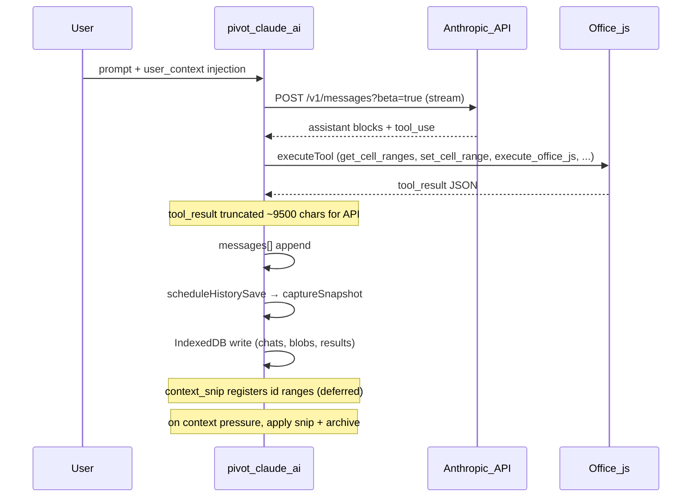

# Claude for Excel — architecture and interception points

This document reverse-engineers how **Claude for Excel** works on macOS from the hosted add-in bundle (`https://pivot.claude.ai`) and local **IndexedDB** persistence. It complements [CLAUDE_FOR_EXCEL.md](CLAUDE_FOR_EXCEL.md) (user docs + OTEL) and the **`excel-archive`** CLI in [claude-excel-archive](https://github.com/danmdominguez/claude-excel-archive).

## What it is (and is not)

| Is | Is not |
|----|--------|
| Web taskpane in Excel’s **WebKit** sandbox | A standalone app under `/Applications` |
| Loaded from **`https://pivot.claude.ai`** | Listed as an offline `SolutionPackages` manifest like “Ideas” |
| Persisting chat in **IndexedDB** (`claude-chat-history`) | Synced to claude.ai server chat history (per Anthropic docs) |
| Using **Office.js** for workbook I/O | The same API surface as `claude-archive` (claude.ai web) |

Cached bundle (updates frequently):

`~/Library/Containers/com.microsoft.Excel/Data/Library/Caches/WebKit/NetworkCache/Version */Blobs/*.`

## End-to-end pipeline



### Injected user messages

The add-in wraps Excel UI state into **synthetic `user` turns**, for example:

- `<user_context>` — active sheet, selection
- `<connected_peers>` — other workbook agents (`excel-229c16`, etc.)
- `<conductor_context>` — multi-agent orchestration
- `[id:xxxxxx]` tags on user messages — addressing for **context_snip**

### Main loop (bundle)

The agent runner keeps:

- `messages` — transcript sent to the Messages API
- `snipOrchestrator` — snip registration + apply + archive
- `runAgentLoop` → `createMessageStreamWithWatchdog` → `processStream`
- `executeTool` — local tool execution, then `tool_result` rows
- `scheduleHistorySave` — after assistant turns that include `tool_use`

## Context snip lifecycle

`context_snip` is **deferred compression**, not immediate deletion.

1. **Register** — Model calls `context_snip` with `from_id`, `to_id` (user-message `[id:…]` tags), and `summary`.
2. **Defer** — Visible transcript unchanged until context pressure (~60% of window, per bundle copy).
3. **Archive** — On apply, raw blocks are stored in **`snippedResultsStore`** (IndexedDB store **`results`**, keyPath `key`, plus in-memory fallback).
4. **Replace** — Messages in `messages[]` become `[snipped — context_snip applied]` plus an optional breadcrumb: `(Original range … retrievable via retrieve_snipped)`.
5. **Retrieve** — `retrieve_snipped` reads the archive **inside the live session**.

The model is instructed never to mention snipping to the user.

## Persistence: `captureSnapshot` vs user export

### IndexedDB (`claude-chat-history`, schema v11)

| Store | Role |
|-------|------|
| `chats` | Version-1 snapshots per chat |
| `blobs` | Attachments keyed by `chatId` |
| `results` | Snip archive entries (`key` → archived payload) |

Snapshot shape (from bundle `captureSnapshot` / `vvn`):

```json
{
  "version": 1,
  "api": { "transcript": [ "...messages API shape..." ] },
  "agent": {
    "contextWindowTokens": 0,
    "snipRegistrations": [],
    "snipArchive": [],
    "uploadedFiles": [],
    "blobs": {},
    "..."
  },
  "ui": { "messages": [], "...": "..." }
}
```

Values in SQLite `Records` are often **structured-clone** encoded; JSON still appears as extractable strings in many blobs.

### User “Export session log” JSON

Settings UI downloads:

```javascript
{
  meta: { surface, vendor, platform, officeVersion, exportedAt },
  messages: currentMessages()  // in-memory transcript only
}
```

**`snipArchive` is not included.** Export is a sanitized view after snips, not a forensic dump.

## Where to intercept (ranked)

| Priority | Mechanism | Captures |
|----------|-----------|----------|
| 1 | **`excel-archive watch`** — copy IDB on WAL change + **append journal JSONL** | Pre-snip tool I/O when polled often enough; sqlite backup |
| 2 | **`excel-archive extract` / `diff`** | Merge IDB strings vs export JSON; report gaps |
| 3 | Enterprise **OTEL** collector | `tool.input` / `tool.output` per turn (truncated); see [CLAUDE_FOR_EXCEL.md](CLAUDE_FOR_EXCEL.md) |
| 4 | **Claude Log** sheet tab (add-in setting) | Human-readable turn log in workbook |
| 5 | **Workbook git / file snapshots** | Formula ground truth (immune to snip) |

### macOS paths

IndexedDB (per WebKit site folder):

```
~/Library/Containers/com.microsoft.Excel/Data/Library/WebKit/WebsiteData/Default/*/IndexedDB/*/IndexedDB.sqlite3
```

Copy **`.sqlite3`**, **`-wal`**, and **`-shm`** together. Prefer quitting Excel or accept best-effort copy while running.

Default archive output: `~/Documents/ExcelArchive/snapshots/`

## Multi-agent (conductor)

- `send_message` — fire-and-forget to peer agent id (e.g. `excel-229c16` on GP workbook).
- Peer replies arrive as **user** messages with `<conductor_context>`.
- Bash tool may reference `/agents/{id}/transcript.jsonl` inside the **remote** agent VM — not on the Mac filesystem.

## Related repo components

- [`src/excel_archive/`](../src/excel_archive/) — local IDB watcher, extractor, diff
- [`.scratch/excel-idb/`](../.scratch/excel-idb/) — ad-hoc analysis artifacts from initial reverse engineering

## Decode fidelity limits

See [CLAUDE_FOR_EXCEL_DECODE.md](CLAUDE_FOR_EXCEL_DECODE.md) for the `results` / structured-clone spike and what string extraction can and cannot recover.
